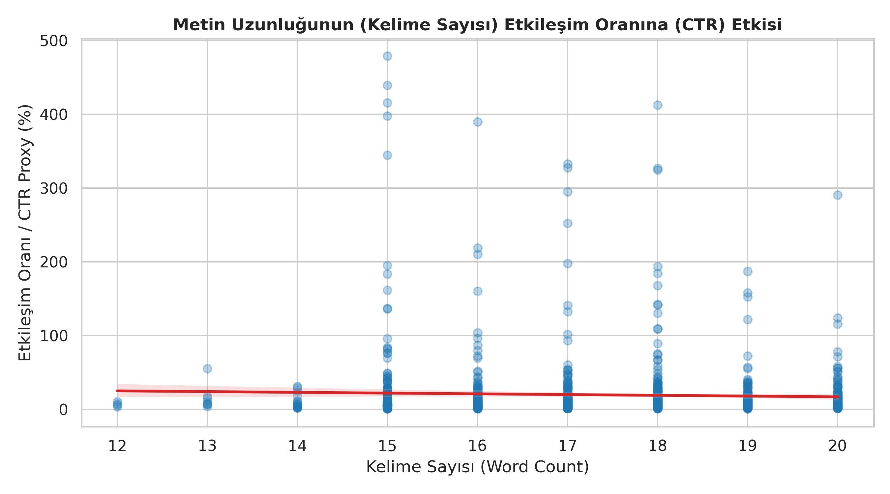
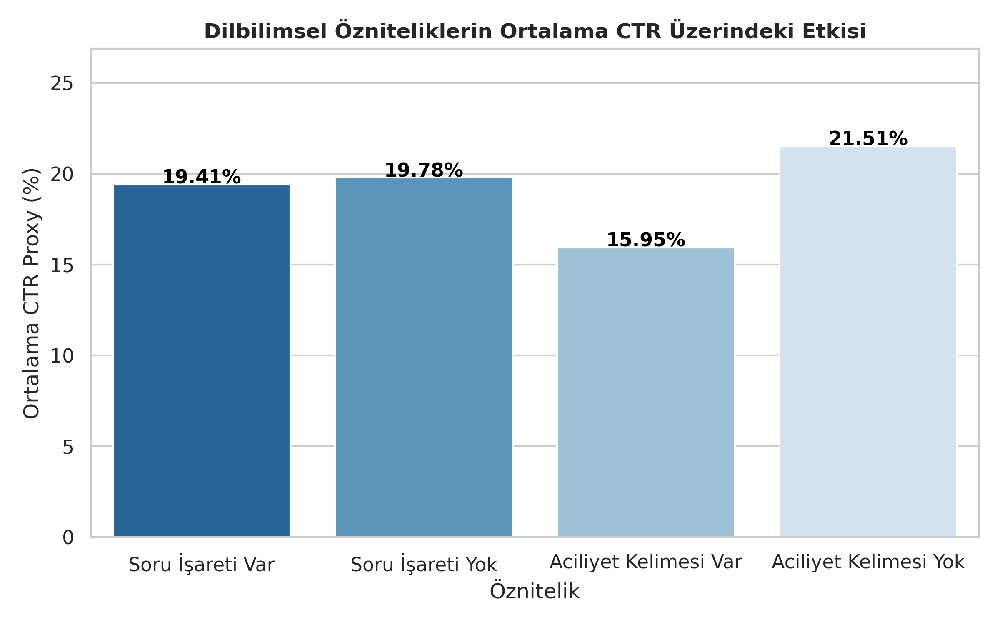
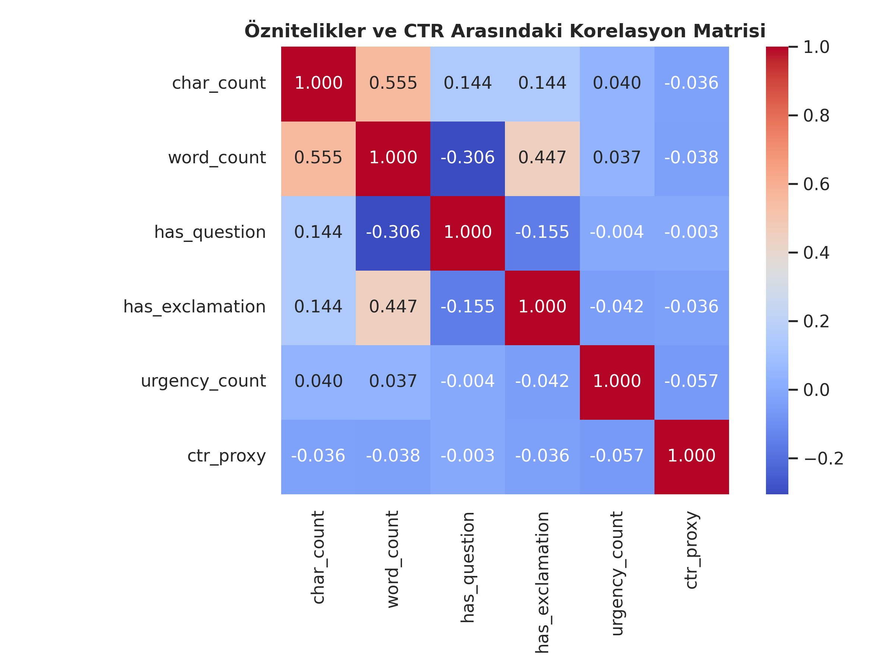

# OnBrand AdCopy: AI-Driven Performance Copywriting & Brand Voice Alignment System


**OnBrand AdCopy**, dijital pazarlama ekipleri için performans odaklı (CTR) reklam metinleri üretirken marka kurumsal ses tonunu koruyan ve düşük uyumlu metinleri kapalı döngü (*closed-loop*) mekanizmasıyla otomatik olarak düzelten bütünleşik bir yapay zekâ karar destek sistemidir.

---

## 📌 Problem ve Çözüm

* **Problem:** Dijital reklam süreçlerinde performans odaklı metinler (tıklama tuzakları, aşırı aciliyet vurgusu) zamanla kurumsal marka sesinden sapar. Geleneksel kılavuz kontrolleri ve manuel denetimler yavaş, öznel ve ölçeklenemezdir.
* **Çözüm:** Çoklu üslupta reklam metni üretimi, XGBoost tabanlı CTR tahmini, Sentence-BERT semantik marka uyum skorlaması ve LLM tabanlı otomatik yeniden yazım (*auto-correction*) döngüsünü tek bir platformda birleştirmek.

---

## ⚙️ Sistem Mimarisi ve İş Akışı

```text
[Kullanıcı Girdisi: Ürün, Hedef Kitle, Marka]
                  │
                  ▼
      [1. LLM Çoklu Üslup Üretimi] ──> (Duygusal, Bilgilendirici, Aciliyet, Mizahi)
                  │
        ┌─────────┴─────────┐
        ▼                   ▼
[2. NLP Öznitelik Çıkarımı]  [3. SBERT Vektör Gömme]
        │                   │
        ▼                   ▼
 [XGBoost CTR Tahmini]     [Kosinüs Benzerliği (Marka Uyumu)]
        │                   │
        └─────────┬─────────┘
                  ▼
     [4. Bileşik Skorlama & Sıralama] ──> (w_CTR * S_CTR + w_Brand * S_Brand)
                  │
          ┌───────┴───────┐
          │ (Uyum < %70)  │ (Uyum >= %70)
          ▼               ▼
[5. LLM Otomatik Düzeltme] [6. Yayına Hazır Reklam Metinleri]
```
---

## 📊 Keşifsel Veri Analizi (EDA) Çıktıları

Proje kapsamında `Social Media Engagement Dataset` üzerinde yapılan analizlerde öne çıkan bulgular:

* **Metin Uzunluğu vs. CTR:** Kelime sayısının etkileşim üzerinde hafif negatif bir eğilimi bulunmaktadır ($r = -0.038$). Sosyal medyada kısa ve vurucu metinler daha yüksek performans sergilemektedir.
* **Aciliyet (Urgency) Paradoksu:** "Hemen", "Kaçırma", "Sınırlı" gibi agresif aciliyet ifadeleri içeren gönderilerin ortalama CTR'ı (%15.95), içermeyenlere (%21.51) kıyasla daha düşüktür.
* **Korelasyon Analizi:** Basit dilbilgisel özniteliklerin CTR ile doğrusal korelasyonunun düşük olması, doğrusal olmayan modellerin (XGBoost) tercih edilmesini doğrulamıştır.

| Kelime Sayısı - CTR İlişkisi | Özniteliklerin CTR Üzerindeki Etkisi | Korelasyon Isı Haritası |
|:---:|:---:|:---:|
|  |  |  |

---

## 🛠️ Teknoloji Yığını

* **Programlama & Ortam:** Python 3.11+, Jupyter Notebook
* **Makine Öğrenmesi & NLP:** XGBoost, scikit-learn, Sentence-Transformers (`all-MiniLM-L6-v2`), NLTK, pandas, numpy
* **Üretken Yapay Zeka:** OpenAI API / Anthropic Claude API
* **Görselleştirme:** Matplotlib, Seaborn

---

## 📁 Depo Yapısı

```bash
├── AI_in_Marketing_Concept_Note_and_Implementation_Plan_Group_18.pdf
├── AI_in_Marketing_Literature_Data_Technology_Submission_Group_18.pdf
├── SIC_Capstone_Idea_Proposal.pdf
├── SIC_Capstone_2.ipynb                 # EDA, öznitelik çıkarımı ve modelleme adımları
├── Social Media Engagement Dataset.csv    # İşlenen veri seti
├── brand_reference.json                  # Samsung, Duolingo, Nike marka kuralları ve referansları
├── eda_plot1_word_count_vs_ctr.png       # Kelime sayısı vs CTR dağılım grafiği
├── eda_plot2_feature_impact.png          # Dilbilimsel özniteliklerin CTR etkisi
└── eda_plot3_correlation_heatmap.png     # Korelasyon matrisi
